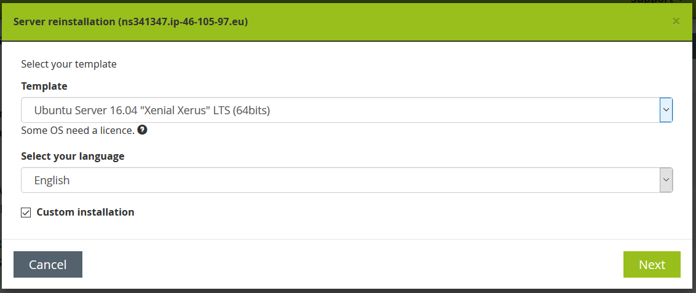
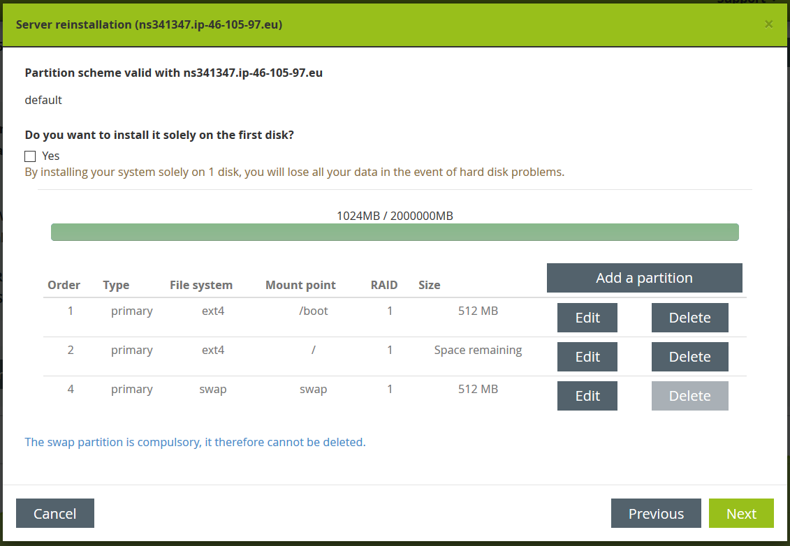

#OVH Server Setup
After logging in to the So You Start web interface you can trigger a reinstall of the server. In the wizard the configuration of the server can be selected.

## Server Installation
### Step 1: Template Selection
We currently use an Ubuntu Server Template with a Custom Installation.

So on this first page select the Ubuntu Server 16.04 LTS (64bits) Template and check the checkbox next to "Custom Installation".


### Step 2: Disk partitions
By default the server would be configured with four partitions (/, /boot, /home, swap), since we do not need a /home partition we have to change the partitions.

1. Delete the /home partition.
2. Edit the / partition and check the checkbox next to "Use the remaining space"
3. Press Save

It should then look like the following picture:


### Step 3: Options
On the options screen it is important to check the checkbox next to "Use the distribution kernel", beause OVH provides a custom kernel by default, which caused problems in the past in our project.


### Step 4: Confirmation
The confirmation screen shows the selected template and the language. By pressing the confirm button all data on the current server are wiped and the server is newly installed.

## Server Configuration
By default it is possible to connect to the server through SSH using a username and password. To make access more secure we only want to allow access with a whitelisted SSH key.

### Creating the SSH key
Use PuttyGen (or another tool) to create an SSH key. 

Export the generated key as an OpenSSH key (in PuttyGen: Conversions > Export OpenSSH key) and save it as a *.pem file.

Copy the public key and save it in another *.pem file.

Lastly save the private key as *.ppk file as well (in PuttyGen: Button "Save private key"), so that you can use it to log in to the server with Putty.

### Registering the public key
Connect to the server using SSH (with username and password).

```Bash
cd ~/.ssh
vi  authorized_keys2
```
add public key to the end of the file and save it.

Test that login with the public key works by opening another OpenSSH session where you use the private key as authorization.

### Disabling password login
When login with the private key works, you can disable the password login.

```Bash
cd /etc/ssh
vi sshd_config
```

Disable password authentication by setting `PasswordAuthentication no`.

To ensure that our changes are accepted the ssh service needs to be restarted:
```Bash
systemctl restart ssh
systemctl status ssh
```
The second command is to verify that the service was correctly restarted.

An additional test is that when you try to connect with a new OpenSSH session using username and password, the following error message should appear:
"No supported authentication methods available (server sent: publickey)"

### Updating public key on Circle CI
Circle CI needs the SSH public key to deploy the server after changes were committed. This is documented on the [Circle CI page](../circle-ci.md#Deploy-key-pair).

## Update DNS lookup address
Finally, DNS entry needs to be updated with the IP address of the new server, so that http://demo.scenarioo.org points to the new server.
